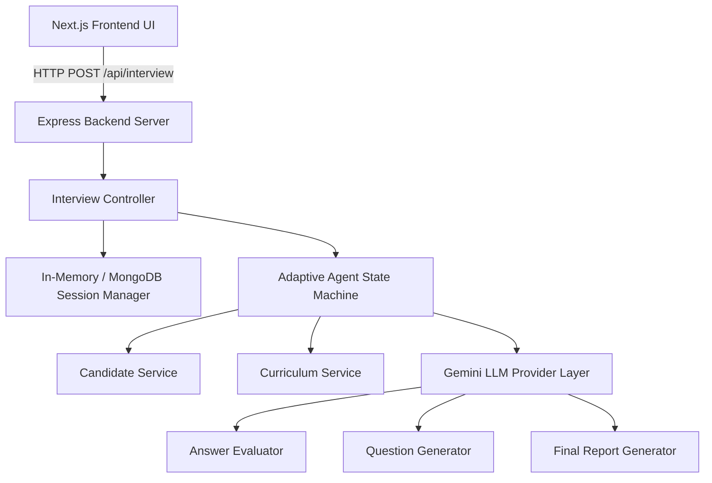

# System Architecture — AI Interview Agent

## System Overview
The **AI Interview Agent** is a full-stack, AI-powered adaptive technical interview platform. It consists of an **Express Backend** host for the required API (`/api/interview`) and Agent Engine, paired with a modern **Next.js Frontend** for interactive interview execution and rich candidate analytics.



---

## 1. Subsystem Breakdown

### 1.1 Backend Services (`backend/src/`)
- **API Router**: Exposes `POST /api/interview` exactly matching the authoritative `technical-spec.md`.
- **Session Manager**: Manages `InterviewState` in-memory (with optional MongoDB persistence).
- **Curriculum Service**: Parses `curriculum.json`, provides topic lookup, day objectives, and tools.
- **Candidate Service**: Parses `candidates.json`, analyzes completion signals, attempts, and skipped missions to generate candidate proficiency profiles.
- **Agent Engine**:
  - `topicSelector.ts`: Selects initial curriculum days based on candidate background and tracks day coverage (minimum 4 days).
  - `questionGenerator.ts`: Synthesizes contextual technical questions using curriculum objectives and conversation context.
  - `answerEvaluator.ts`: Evaluates candidate responses against technical correctness, conceptual depth, practical understanding, and communication.
  - `feedbackGenerator.ts`: Generates structured final reports with summary, strengths, gaps, and revision recommendations.
- **LLM Abstraction (`ai/llm.ts`)**: Encapsulates Gemini API calls (`@google/genai` or `@google/generative-ai`) with structured JSON mode and retry/fallback logic.

### 1.2 Frontend Application (`frontend/`)
- **Landing Page (`/`)**: Candidate selector dropdown pre-populated from `candidates.json`, candidate summary view, and single-click interview initiation.
- **Interview Interface (`/interview`)**: Interactive chat workspace displaying current curriculum topic, question progress counter (e.g. 5/10), current difficulty badge, adaptive follow-up indicator, and user input area.
- **Feedback Dashboard (`/feedback`)**: Rich visual summary displaying overall score breakdown, strengths, gaps, and recommended revision steps.

---

## 2. Interview State Schema

```typescript
export interface ConversationMessage {
  role: 'interviewer' | 'candidate';
  content: string;
  timestamp: string;
  topic?: string;
  day?: number;
  difficulty?: 'easy' | 'medium' | 'hard';
}

export interface QuestionRecord {
  questionId: string;
  day: number;
  topic: string;
  question: string;
  difficulty: 'easy' | 'medium' | 'hard';
  type: 'conceptual' | 'explanation' | 'why' | 'comparison' | 'debugging' | 'architecture' | 'scenario' | 'tradeoff';
}

export interface AnswerEvaluation {
  questionId: string;
  technicalCorrectness: number; // 0-10
  conceptualDepth: number;     // 0-10
  practicalUnderstanding: number; // 0-10
  communication: number;        // 0-10
  overallScore: number;         // 0-10
  strengths: string[];
  missingConcepts: string[];
  misconceptions: string[];
  reasoning: string;
  recommendedAction: 'FOLLOW_UP' | 'INCREASE_DIFFICULTY' | 'DECREASE_DIFFICULTY' | 'CHANGE_TOPIC';
}

export interface InterviewState {
  sessionId: string;
  candidateId: string;
  candidateName: string;
  candidateRole: string;
  status: 'not_started' | 'in_progress' | 'completed';
  questionNumber: number;
  minimumQuestions: number;
  maximumQuestions: number;
  coveredDays: number[];
  coveredTopics: string[];
  currentDay?: number;
  currentTopic?: string;
  difficulty: 'easy' | 'medium' | 'hard';
  conversation: ConversationMessage[];
  questionHistory: QuestionRecord[];
  answerEvaluations: AnswerEvaluation[];
  strengths: string[];
  gaps: string[];
  missingConcepts: string[];
  overallScore?: number;
  finalFeedback?: {
    summary: string;
    strengths: string[];
    gaps: string[];
    next: string[];
  };
}
```

---

## 3. Decision Logic & Flow

```text
       Candidate Answer Received
                   │
                   ▼
         Evaluate Answer (LLM)
      [0-10 scores, missing concepts]
                   │
                   ▼
       Questions >= 8 AND Covered Days >= 4?
       ├── YES ──► Candidate finished or final topic? ──► Return done: true + Feedback
       └── NO  ──► Determine Next Action:
                     ├── Missing Critical Concept ──► FOLLOW_UP (same topic)
                     ├── High Score (>= 8)       ──► INCREASE_DIFFICULTY
                     ├── Low Score (< 5)        ──► DECREASE_DIFFICULTY
                     └── Assessed (2 turns)     ──► CHANGE_TOPIC (new curriculum day)
```
